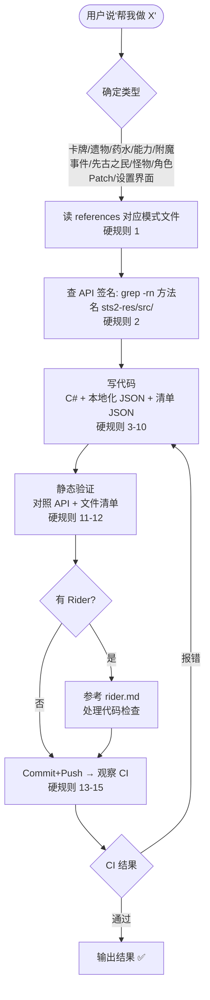

# 杀戮尖塔 2 纯原生 Mod 开发 — AI 工作流

> 🦞 零第三方依赖：只靠 `0Harmony.dll` + `sts2.dll`。
> 唯一例外：设置界面用 BaseLib（见 settings.md）。

---

## 🚫 硬规则（优先级高于一切，必须逐条遵守）

### 一、写前必读
1. 写代码前必须读 references 对应模式文件（`xx.md` 为导航页，含**章节导航表**；按需读对应子文件 `xx-*.md`），完整读完，不准凭训练数据记忆写
2. 写代码前必须查 API 签名：`grep -rn "方法名" sts2-res/src/` 确认参数类型和顺序
3. 不准复制外部 mod 源码，只准用 references 模板 + 原生 `sts2.dll` API（设置界面除外，可用 BaseLib `SimpleModConfig`）

### 二、代码规范
4. 所有模型类必须注册（二选一，不混用）：① 自定义 `[XxxPool]`/`[XxxModel]` Attribute + 扫描自动注册；② 手动 `ModHelper.AddModelToPool` / `ModelDb.Inject`
5. 所有 `[SavedProperty]` 必须调 `InjectTypeIntoCache`
6. 所有 Harmony Patch 必须用 try-catch 包裹
7. `OnPlay` 必须有 `if (cardPlay.Target == null) return;` 空值检查
8. `OnUpgrade` 必须调 `UpgradeValueBy()`，不能直接改字段值

### 三、结构完整
9. 必须包含 `ModEntry.cs`（三阶段）+ `ModInfo.cs`（常量）+ 至少一个模型类 + 本地化 JSON + 清单 JSON
10. `ModEntry.Initialize` 必须三阶段：Harmony → 注册 → 设置，缺一不可

### 四、静态验证
11. 逐行对照 API 源码检查：方法名存在、命名空间正确、无外部 mod 依赖、`[SavedProperty]` 有对应 `InjectTypeIntoCache`、Harmony 有 try-catch
12. 文件清单完整：入口 + 模型 + 本地化 JSON + 清单 JSON，缺一不可输出

### 五、GitHub 工作流（如果项目托管在 GitHub 且配置了 CI）
13. 修改完成后必须 commit + push 到对应分支
14. 必须观察 Actions 运行结果
15. Actions 运行异常时排查修复，重新 commit+push

---

## 🚦 总工作流

---

## 📂 参考资料

> 📌 每个模块的 `xx.md` 为导航页（概述+常见问题+**章节导航表**），正文拆在 `xx-*.md`。先开导航页，再按需读子文件。

| 分类 | 文件 | 内容 |
|------|------|------|
| `setup/` | [environment-setup.md](references/setup/environment-setup.md) | 环境搭建、创建项目、PCK 打包 |
| `setup/` | [project-skeleton.md](references/setup/project-skeleton.md) | 生产级项目骨架（目录/路径检测/自动打 PCK） |
| `setup/` | [rider.md](references/setup/rider.md) | Rider 开发环境配置（代码检查、Harmony 抑制规则） |
| `relic/` | [relic.md](references/relic/relic.md) | 自定义遗物（模板、稀有度、池、图标、本地化） |
| `card/` | [card.md](references/card/card.md) | 自定义卡牌（构造函数、API 速查、卡池、肖像、本地化） |
| `potion/` | [potion.md](references/potion/potion.md) | 自定义药水（属性、回调、图标、池、本地化） |
| `enchantment/` | [enchantment.md](references/enchantment/enchantment.md) | 自定义附魔（回调、附魔、本地化、图标） |
| `event/` | [event.md](references/event/event.md) | 自定义事件（选项、多页、先古之民、Patch、本地化） |
| `power/` | [power.md](references/power/power.md) | 自定义能力（Buff/Debuff、属性、回调、本地化） |
| `character/` | [character.md](references/character/character.md) | 自定义角色（卡池/遗物池/药水池、场景资源、注册） |
| `monster/` | [monster.md](references/monster/monster.md) | 自定义敌怪 & 遭遇（状态机、AI 行为树、注册） |
| `modifier/` | [modifier.md](references/modifier/modifier.md) | 自定义 Modifier（运行规则、注册、效果实现） |
| `orb/` | [orb.md](references/orb/orb.md) | 自定义球体（被动/激发、图标、精灵、随机池） |
| `act/` | [act.md](references/act/act.md) | 自定义章节（地图背景、音乐、宝箱、房间配置） |
| `pet/` | [pet.md](references/pet/pet.md) | 自定义宠物（固定不行动 AI、血条、场景） |
| `resource/` | [resource.md](references/resource/resource.md) | 自定义资源（法力/怒气等 + 卡牌费用 + UI） |
| `badge/` | [badge.md](references/badge/badge.md) | 自定义模组徽章（Badge 继承、图标、注册） |
| `rest-site/` | [rest-site.md](references/rest-site/rest-site.md) | 自定义休息点选项（RestSiteOption 继承、图标、注入） |
| `pile/` | [pile.md](references/pile/pile.md) | 自定义牌堆（PileType注入、定位、动画） |
| `reward/` | [reward.md](references/reward/reward.md) | 自定义奖励（RewardType 注入、序列化、示例） |
| `energy/` | [energy.md](references/energy/energy.md) | 自定义能量（图标、类型、视觉效果） |
| `harmony/` | [harmony.md](references/harmony/harmony.md) | Harmony 补丁模式（PatchCategory、安全、组织规范） |
| `harmony/` | [harmony-custom-power-sfx.md](references/harmony/harmony-custom-power-sfx.md) | Transpiler 实战：自定义能力音效（零第三方依赖） |
| `serialization/` | [serialization.md](references/serialization/serialization.md) | 序列化与注册（ModelDb、SavedProperty、InjectTypeIntoCache） |
| `settings/` | [settings.md](references/settings/settings.md) | 设置界面（BaseLib SimpleModConfig、Attribute、本地化） |
| `baselib/` | [design-patterns.md](references/baselib/design-patterns.md) | 纯原生设计模式总纲（从 BaseLib 提炼，零第三方依赖） |

---

## 📦 备份存档

旧版本 references 存档：[yehuoshun/slay-the-spire-2-mod-skill-archive](https://github.com/yehuoshun/slay-the-spire-2-mod-skill-archive)
包含 v1/v2 版本记录，供回溯对比。