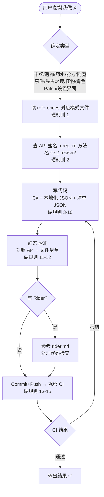

# 杀戮尖塔 2 纯原生 Mod 开发 — AI 工作流

> 🦞 零第三方依赖：只靠 `0Harmony.dll` + `sts2.dll`（含设置界面，纯原生方案见 [settings.md](references/settings/settings.md)）。

---

## 🚫 硬规则（优先级高于一切，必须逐条遵守）

### 一、写前必读
1. 写代码前必须读 references 对应模式文件（`xx.md` 为导航页，含**章节导航表**；按需读对应子文件 `xx-*.md`），完整读完，不准凭训练数据记忆写
2. 写代码前必须查 API 签名：`grep -rn "方法名" sts2-res/src/` 确认参数类型和顺序
3. 不准复制外部 mod 源码，只准用 references 模板 + 原生 `sts2.dll` API

### 二、代码规范
4. 所有模型类必须注册（二选一，不混用）：① 自定义 `[XxxPool]`/`[XxxModel]` Attribute + 扫描自动注册；② 手动 `ModHelper.AddModelToPool` / `ModelDb.Inject`
5. 所有 `[SavedProperty]` 必须调 `InjectTypeIntoCache`
6. 所有 Harmony Patch 必须用 try-catch 包裹
7. `OnPlay` 必须有 `if (cardPlay.Target == null) return;` 空值检查
8. `OnUpgrade` 必须调 `UpgradeValueBy()`，不能直接改字段值

### 三、结构完整
9. 必须包含 `ModEntry.cs`（三阶段）+ `ModInfo.cs`（常量）+ 至少一个模型类 + 本地化 JSON + 清单 JSON
10. `ModEntry.Initialize` 必须三阶段：Harmony → 注册 → 设置，缺一不可

### 四、静态验证
11. 逐行对照 API 源码检查：方法名存在、命名空间正确、无外部 mod 依赖、`[SavedProperty]` 有对应 `InjectTypeIntoCache`、Harmony 有 try-catch
12. 文件清单完整：入口 + 模型 + 本地化 JSON + 清单 JSON，缺一不可输出

### 五、GitHub 工作流（如果项目托管在 GitHub 且配置了 CI）
13. 修改完成后必须 commit + push 到对应分支
14. 必须观察 Actions 运行结果
15. Actions 运行异常时排查修复，重新 commit+push
16. 文档改动必须过 [sts2-mod-examples](https://github.com/yehuoshun/sts2-mod-examples) 编译验证（见 LEARN.md「测试与验证流程」），CI 全绿才算完

---

## 🚦 总工作流

```mermaid
graph TD
    A(["用户说'帮我做 X'"]) --> B{确定类型}
    B -->|卡牌/遗物/药水/能力/附魔<br>事件/先古之民/怪物/角色<br>Patch/设置界面| C[读 references 对应模式文件<br>硬规则 1]
    C --> D[查 API 签名: grep -rn 方法名 sts2-res/src/<br>硬规则 2]
    D --> E[写代码<br>C# + 本地化 JSON + 清单 JSON<br>硬规则 3-10]
    E --> F[静态验证<br>对照 API + 文件清单<br>硬规则 11-12]
    F --> G{有 Rider?}
    G -->|是| H[参考 rider.md<br>处理代码检查]
    G -->|否| I[Commit+Push → 观察 CI<br>硬规则 13-15]
    H --> I
    I --> J{CI 结果}
    J -->|通过| K[输出结果 ✅]
    J -->|报错| E
```

---

## 📂 参考资料

> 📌 每个模块的 `xx.md` 为导航页（概述+常见问题+**章节导航表**），正文拆在 `xx-*.md`。先开导航页，再按需读子文件。

| 分类 | 文件 | 内容 |
|------|------|------|
| `setup/` | [environment-setup.md](references/setup/environment-setup.md) | 环境/骨架/构建/CI/loader 全流程 |
| `relic/` | [relic.md](references/relic/relic.md) | 遗物 |
| `card/` | [card.md](references/card/card.md) | 卡牌 |
| `potion/` | [potion.md](references/potion/potion.md) | 药水 |
| `enchantment/` | [enchantment.md](references/enchantment/enchantment.md) | 附魔 |
| `event/` | [event.md](references/event/event.md) | 事件 + 先古之民 |
| `power/` | [power.md](references/power/power.md) | 能力 |
| `character/` | [character.md](references/character/character.md) | 角色 |
| `monster/` | [monster.md](references/monster/monster.md) | 敌怪 & 遭遇 |
| `modifier/` | [modifier.md](references/modifier/modifier.md) | Modifier |
| `orb/` | [orb.md](references/orb/orb.md) | 球体 |
| `act/` | [act.md](references/act/act.md) | 章节 |
| `pet/` | [pet.md](references/pet/pet.md) | 宠物 |
| `resource/` | [resource.md](references/resource/resource.md) | 自定义资源 |
| `badge/` | [badge.md](references/badge/badge.md) | 徽章 |
| `rest-site/` | [rest-site.md](references/rest-site/rest-site.md) | 休息点 |
| `pile/` | [pile.md](references/pile/pile.md) | 牌堆 |
| `reward/` | [reward.md](references/reward/reward.md) | 奖励 |
| `energy/` | [energy.md](references/energy/energy.md) | 能量 |
| `harmony/` | [harmony.md](references/harmony/harmony.md) | Harmony 补丁 |
| `serialization/` | [serialization.md](references/serialization/serialization.md) | 序列化与注册 |
| `settings/` | [settings.md](references/settings/settings.md) | 设置界面（纯原生） |
| `settings/` | [modconfig.md](references/settings/modconfig.md) | ModConfig 源码精读：设置页 Tab 注入纯原生转译 + 反射桥（生态可选） |
| `baselib/` | [design-patterns.md](references/baselib/design-patterns.md) | 纯原生设计模式总纲 |
| `multiplayer/` | [multiplayer.md](references/multiplayer/multiplayer.md) | 多人模式 |

> 模块级索引（导航页 + setup 全列）见 [index.md](references/index.md)；子文件索引在各模块导航页章节导航表内。

---

## 📦 备份存档

旧版本 references 存档：[yehuoshun/slay-the-spire-2-mod-skill-archive](https://github.com/yehuoshun/slay-the-spire-2-mod-skill-archive)
包含 v1/v2 版本记录，供回溯对比。