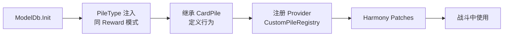

# 自定义牌堆

> 纯原生实现（零第三方依赖）。灵感来源：BaseLib `CustomPile`。

## 概述

原生有 5 种牌堆（`PileType`）：Draw(抽牌)、Discard(弃牌)、Hand(手牌)、Exhaust(消耗)、Deck(牌组)。自定义牌堆允许创造全新的堆类型，如「虚空堆」「印记堆」「储备堆」。

完整实现需要：enum 注入 + 继承 CardPile + 注册 provider + 5 个 Harmony Patch。**不需要序列化**（牌堆是战斗临时数据）。

## 原理

## 章节导航

| 内容 | 文件 |
|------|------|
| PileType 注入 + 基类 + 注册 | [pile-core.md](pile-core.md) |
| Harmony Patch 详解 | [pile-patches.md](pile-patches.md) |
| Patch 5 + 注册 + 示例 | [pile-patches-more.md](pile-patches-more.md) |

## 常见问题

| 问题 | 解决 |
|------|------|
| 自定义牌堆不出现 | 检查 `PileType` 是否注入 + provider 是否注册 |
| 牌堆位置不对 | `GetTargetPosition` 返回坐标有问题 |
| 卡牌移动动画不对 | `CustomTween` 返回 false = 走默认动画 |
| 多牌堆选择界面不显示图标 | 需调用 `MultiPileCardSelect.RegisterPileIndicator` |

## 演进路线

- 当前：手动 enum 注入 + 5 个 Patch + 手动注册
- 更优：如果 BaseLib 被设为依赖，直接继承 `CustomPile` + `[CustomEnum]` + `RegisterCustomPile` 即可
- 纯原生优点：完全可控；缺点：样板代码多、Patch 多