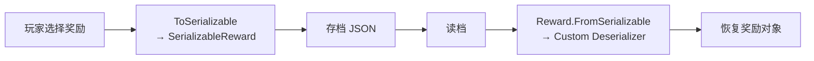

# 自定义奖励：SerializableReward 字段参考与注册时机

> 序列化注册流程与模板见 [reward-serialization.md](reward-serialization.md)。

## 序列化流程



原生 `Reward` 有 `ToSerializable()` 虚方法返回 `SerializableReward`。反序列化依赖 `Reward.FromSerializable(SerializableReward, Player)` ——这是一个静态方法，内部用了 `switch` 或字典查找 `RewardType`。纯原生需要拦截这个方法，加入自定义分支。

## 序列化注册（Harmony Prefix）

```csharp
using System.Reflection;
using HarmonyLib;
using MegaCrit.Sts2.Core.Entities.Players;
using MegaCrit.Sts2.Core.Rewards;
using MegaCrit.Sts2.Core.Saves.Runs;

public static class CustomRewardRegistry
{
    private static readonly Dictionary<RewardType, Func<SerializableReward, Player, Reward>> 
        _deserializers = new();

    public static void Register(RewardType type, 
        Func<SerializableReward, Player, Reward> deserializer)
    {
        _deserializers[type] = deserializer;
    }

    /// <summary>在 ModEntry.Initialize 中调用，注册所有自定义奖励</summary>
    public static void RegisterAll()
    {
        foreach (var (type, deserializer) in _deserializers)
        {
            Logger.Info($"Registered deserializer for reward type {type}");
        }
    }
}

[HarmonyPatch(typeof(Reward), nameof(Reward.FromSerializable))]
public static class RewardDeserializationPatch
{
    [HarmonyPrefix]
    private static bool Prefix(SerializableReward save, Player player, ref Reward __result)
    {
        if (CustomRewardRegistry.TryGetDeserializer(save.RewardType, out var deserializer))
        {
            __result = deserializer(save, player);
            return false; // 跳过原生逻辑
        }
        return true; // 不是自定义奖励，走原生
    }
}
```

## 奖励类的序列化模板

```csharp
using MegaCrit.Sts2.Core.Rewards;
using MegaCrit.Sts2.Core.Saves.Runs;

public class MyReward : Reward
{
    public int CustomData { get; set; }  // 需要持久化的自定义字段

    public MyReward(Player player) : base(player) { }

    protected override RewardType RewardType => MyRewardTypes.MyType;

    // 序列化：将自定义数据写入 SerializableReward
    public override SerializableReward ToSerializable()
    {
        var save = base.ToSerializable();
        save.GoldAmount = CustomData; // 复用原生字段（如果没有自定义 save slot）
        // 或用 save.AdditionalData / save.SerializedStrings 等
        return save;
    }

    // 反序列化方法（静态，供注册用）
    public static MyReward CreateFromSave(SerializableReward save, Player player)
    {
        return new MyReward(player)
        {
            CustomData = save.GoldAmount
        };
    }
}

// 注册（在 ModEntry.Initialize 中）
CustomRewardRegistry.Register(MyRewardTypes.MyType, MyReward.CreateFromSave);
```

