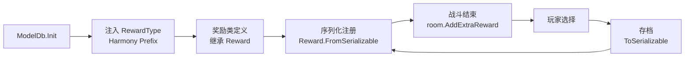

# 自定义奖励

> 纯原生实现（零第三方依赖）。灵感来源：BaseLib `CustomReward`。
> **警告**：自定义奖励涉及 enum 注入 + 序列化 Hook + 存档兼容，实现不当会导致存档损坏或多人同步失败。每个细节必须严格按照模板写。

## 概述

游戏战斗结算时显示奖励面板：金币、卡牌、药水、遗物。这些是原生 `RewardType` 枚举的值。

如果需要全新的奖励类型（变形卡牌、升级卡牌、翻牌选择、自定义交互），需要：

1. **注入新 `RewardType` 值** — 原生 enum 不能直接加，必须运行时通过 Harmony 注入
2. **创建奖励类** — 继承原生 `Reward`，重写属性/回调
3. **注册序列化** — 让自定义奖励能存档/读档/多人同步
4. **加入战斗奖励** — 通过 `room.AddExtraReward()` 或 Patch 奖励池

## 原理

## 章节导航

| 内容 | 文件 |
|------|------|
| RewardType 注入 | [reward-core.md](reward-core.md) |
| 奖励基类 | [reward-base.md](reward-base.md) |
| 序列化流程与注册 | [reward-serialization.md](reward-serialization.md) |
| SerializableReward 字段参考 | [reward-save.md](reward-save.md) |
| 完整示例 | [reward-examples.md](reward-examples.md) |
| 更多示例与注册 | [reward-examples-more.md](reward-examples-more.md) |

## 常见问题

| 问题 | 解决 |
|------|------|
| 自定义奖励面板不出现 | 检查 `RewardType` 是否在 `ModelDb.Init` 前注入 |
| 存档后奖励丢失 | 检查 `ToSerializable` / `FromSerializable` 实现 |
| 多人模式下不同步 | 自定义数据必须实现 `IRewardSyncData` 并注册同步 Handler |
| `RewardType` 值与其他 Mod 冲突 | 用 namespace hash 作为偏移量，见 [reward-core.md](reward-core.md) |

## 演进路线

- 当前：手动 enum 注入 + 手动序列化注册
- 更优：如果 BaseLib 被设为依赖，直接继承 `CustomReward` + `[CustomEnum]` 即可，零样板代码
- 纯原生优点：完全可控，不背依赖；缺点：样板代码多